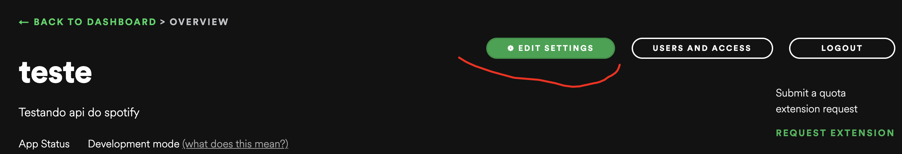
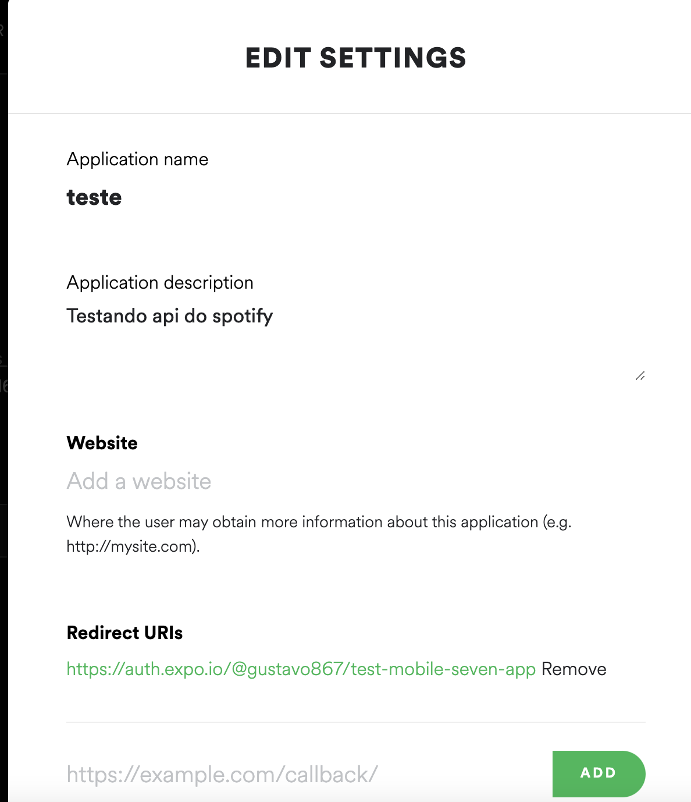

# COMO RODAR O PROJETO !!

### Crie uma conta de desenvolvedor no spotify

### Link: https://developer.spotify.com/dashboard/login

</img>

### Configure a url de redirecionamento para https://auth.expo.io/@seu-usuario/spotify-integration

</img>

### Após isso, crie um arquivo config.ts na raiz do projeto, e insira as duas variavéis: CLIENT_ID e CLIENT_SECRET, que aparecem na dashboard do spotify

==========

# Rodando o projeto

## 🔧 Comandos para rodar o app

```bash
# Execute o comando
  $ yarn ou npm install
# Executar o comando para abrir o expo no seu navegador
  $ yarn start
# Escaneie o qr code pelo aplicativo do expo go e pronto!
```
