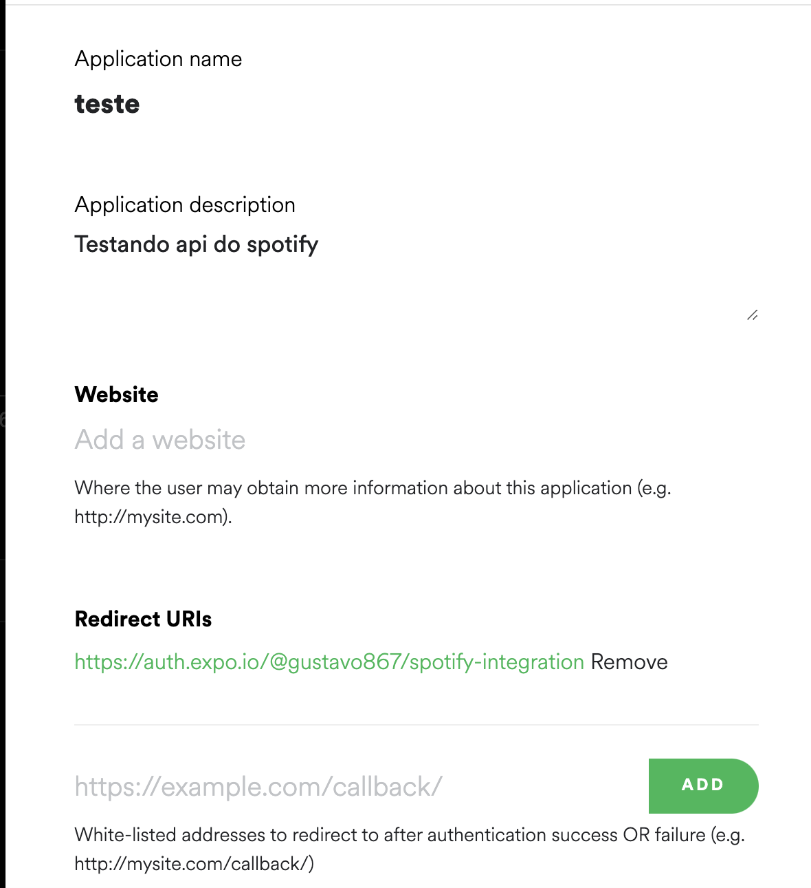

# COMO RODAR O PROJETO !!

### Crie uma conta de desenvolvedor no spotify

### Link: https://developer.spotify.com/dashboard/login

</img>

### Configure a url de redirecionamento para https://auth.expo.io/@seu-usuario/spotify-integration

</img>

### Após isso, crie um arquivo config.ts na raiz do projeto, e insira tres variavéis: CLIENT_ID e CLIENT_SECRET, que aparecem na dashboard do spotify e USER que é o seu usuário do expo

==========

## 🔧 Comandos para fazer login no expo

```bash
# Execute o comando
  $ expo login
# Executar o comando para pegar o nome do seu usuário
  $ expo whoami
```

# Rodando o projeto

## 🔧 Comandos para rodar o app

```bash
# Execute o comando
  $ yarn ou npm install
# Executar o comando para abrir o expo no seu navegador
  $ yarn start
# Escaneie o qr code pelo aplicativo do expo go e pronto!
```
